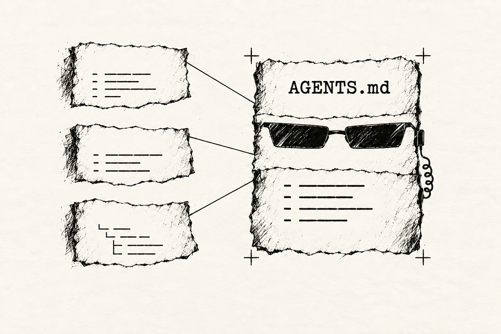
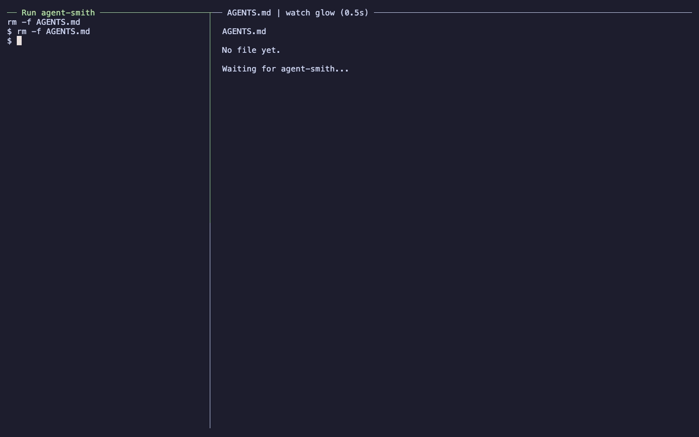

# Agent Smith 🕶️

<p align="center"></p>

<p align="center">
  <em>Smith your AGENTS.md file.</em><br />
  Build living agent instructions from the project sources you already maintain.
</p>

<p align="center"><a href="https://github.com/Mehdi-H/agent-smith/actions/workflows/release.yml?query=branch%3Amain"></a> <a href="pyproject.toml"></a> <a href="https://codecov.io/github/Mehdi-H/agent-smith"></a> <a href="https://pypi.org/project/agent-smith-cli/"></a> <a href="LICENSE"></a></p>

<p align="center"><code>uv tool install agent-smith-cli</code></p>

## The problem

Agent instructions drift when they are maintained separately from the project.
Commands change, tools move on and architecture decisions accumulate, while a
hand-written `AGENTS.md` quietly becomes incomplete or misleading. One-off
generation only postpones the same problem.

Agent instructions should evolve with the sources that already describe the
project, without surrendering control of the result.

## How Agent Smith solves it

Run `agent-smith` at your project root. It rebuilds `AGENTS.md` from your README
overview, your mise tool declarations, documented just commands, architecture
decision filenames and optional custom extractors.

The result is deterministic, repeatable Markdown: update the sources you own,
regenerate the instructions and review an ordinary diff. No nondeterministic
`/init` step to rerun, no tokens spent on a task a deterministic tool can handle,
and no second document to keep in sync.

## Demo

> [!NOTE]
> Agent Smith is available on [PyPI](https://pypi.org/project/agent-smith-cli/).
> It is under active development; versions remain below 1.0.

> [!TIP]
> **See the real output: [our generated AGENTS.md](AGENTS.md).**
> We eat our own dog food: Agent Smith generates this repository's agent
> instructions from its own project sources.



## Install

The PyPI distribution is named **`agent-smith-cli`**; the executable remains
`agent-smith`.

Agent Smith supports Python 3.11–3.14. Install the published CLI from PyPI with uv:

```sh
uv tool install agent-smith-cli
```

This installs the command in an isolated environment.

> [!TIP]
> If uv reports that its tool directory is missing from your PATH, run
> `uv tool update-shell` and restart your terminal.

Alternatively, install with pip in an activated Python virtual environment:

```sh
python -m pip install agent-smith-cli
```

## Run and verify

```sh
agent-smith --version
agent-smith --help
agent-smith
```

> [!TIP]
> To confirm installation, check that `--version` prints the installed Agent Smith version
> and `--help` displays the available options. Both should exit successfully.

Run the command **from the root of the project you want to document**. It creates
or replaces `AGENTS.md` in that directory. Successful generation is silent;
open the file to verify the result. No configuration is needed when you follow
the conventions below.

```sh
agent-smith
cat AGENTS.md
```

Use `agent-smith --output instructions.md` to choose another output filename.
The document has an H1 containing its filename, an H2 for each section and a
quoted footer identifying the command that produced that section.

## Conventions

<details>
<summary><strong>Overview: a README.md at the project root</strong></summary>

<br />

Place a `README.md` at the root with a top-level H1 followed by a nonempty
introduction. Agent Smith copies the Markdown between that H1 and the first
following H2 into **Overview**. No extraction script is required.

```markdown
# My project

Describe what the project does and why someone would use it.

## Installation

This section is outside the extracted overview.
```

The first H2 ends the overview; if there is no H2, extraction continues to the
end of the file. Badges, links and GitHub alerts in the introduction are kept.
An absent README, a missing H1 or an empty introduction produces an error.
Images, badges and HTML `` tags are omitted from the generated overview;
text, useful links and code examples are preserved. The README stays unchanged.
Use `--no-overview` to disable this section.

</details>

<details>
<summary><strong>Main tech stack: declared tools in a root mise.toml</strong></summary>

<br />

Put a `mise.toml` at your project root with a nonempty `[tools]` table:

```toml
[tools]
python = ["3.14", "3.11"]
uv = "latest"
node = { version = "lts", postinstall = "corepack enable" }
```

Agent Smith automatically adds:

```markdown
## Main tech stack

- `python` — `3.14`, `3.11`
- `uv` — `latest`
- `node` — `lts`
```

Tool names (including backend prefixes) and declared versions stay in file order.
Strings, arrays of versions, and tables with a string `version` are supported,
including arrays of those tables. Installation options are ignored. Agent Smith
reads TOML directly: mise need not be installed, no hooks or templates execute,
and aliases such as `latest` remain literal. It does not resolve installed versions,
merge global/local configuration, or inspect other files such as `.python-version`.

With no root `mise.toml`, this section is omitted. Use `--no-tech-stack` or
`[tech_stack].enabled = false` to disable it. In the tool's configuration, `source`
selects another TOML file and `title` changes the heading. An explicit
`enabled = true` requires that source to exist. Invalid TOML, an empty `[tools]`
table or an unsupported version declaration fails generation and preserves the
existing document. The footer names the exact `agent-smith` invocation.

</details>

<details>
<summary><strong>Available commands: a documented, grouped justfile at the project root</strong></summary>

<br />

Document your project's practices in a root `justfile` (also detected as
`Justfile` or `.justfile`). Give each recipe a descriptive comment and a group,
and provide a `help` recipe that prints the standard `just --list` output:

```just
# List the project's available commands.
[group("Help")]
help:
    @just --list

# Check modified files for whitespace errors.
[group("Quality")]
check-whitespace:
    git diff --check
```

[Install just](https://just.systems/man/en/installation.html) and make sure
`just help` works from the project root. Agent Smith automatically runs that
command and converts its output to **Available commands**: Markdown lists under
group subheadings, preserving recipe order, parameters and descriptions.
For the example above, the section contains:

```markdown
## Available commands

### Help

- `just help` — List the project's available commands.

### Quality

- `just check-whitespace` — Check modified files for whitespace errors.
```

The section ends with a footer naming `just help`. Listed recipes are not
executed; only the help recipe runs. With no root justfile, this section is
omitted and just is not required. Use `--no-available-commands` to disable it.
If help fails or does not produce the supported list format, generation fails
and the existing `AGENTS.md` is preserved. Custom help formats can be supplied
as Markdown through a custom section instead.

</details>

<details>
<summary><strong>Architecture decisions: an ADR directory declared in .adr-dir</strong></summary>

<br />

Use [adr-tools](https://github.com/npryce/adr-tools) and a root `.adr-dir` containing
the path to your decisions directory, for example `docs/adr`. When that file exists,
Agent Smith runs `adr list` and adds a compact index:

```markdown
## Architecture decisions

Directory: `docs/adr`

- `0001-record-architecture-decisions`
- `0002-use-python`
```

The directory appears once, using the content of `.adr-dir`. Each bullet contains
only a filename without its final `.md` extension: numbers, hyphens and ordering
from `adr list` are preserved. ADR contents and their Markdown headings are never
read. Use meaningful filenames so the index conveys decisions without loading
individual records. All records listed by adr-tools are included; their status
is not inferred from their filenames.

The footer names `adr list`. The command must be installed and runnable from the
project root, and its listed paths must match `.adr-dir`. With no `.adr-dir`, this
section is omitted. Empty or invalid metadata, a failed command or unsupported
output fails generation while preserving the existing document.

Use `--no-architecture-decisions` or `[architecture_decisions].enabled = false`
to disable this built-in, and `title` to rename its heading. Setting `enabled = true`
explicitly requires `.adr-dir` even if it was not detected automatically.

</details>

## Configure sections

An optional root `agent-smith.toml` customizes built-in sections and adds custom
extractors. For example, to enable the four built-ins and append tracked files:

```toml
output = "AGENTS.md"

[overview]
enabled = true
source = "README.md"
title = "Overview"

[available_commands]
enabled = true
title = "Available commands"
command = "just help"

[tech_stack]
enabled = true
source = "mise.toml"
title = "Main tech stack"

[architecture_decisions]
enabled = true
title = "Architecture decisions"

[[sections]]
title = "Tracked files"
command = "git ls-files"
```

Each custom section uses its command's UTF-8 stdout as Markdown, followed by a
footer with the exact command. Sections appear in configuration order after the
built-in overview, main tech stack, available commands and architecture decisions. Set `[available_commands].enabled = false`
to disable command discovery, or change its `command` to another source of
standard just list output, such as `just --list`. Explicit `enabled = true`
requires the command to work even if no root justfile was detected.

### Add multiple custom sections

In TOML, double brackets such as `[[sections]]` add an item to an **array of
tables**: here, a list of custom sections. Repeat that exact header for each
section, followed by its own `title` and `command`. You do not need to number
the headers or give them different names.

For example, use these three blocks in `agent-smith.toml`:

```toml
[[sections]]
title = "Tracked files"
command = "git ls-files"

[[sections]]
title = "Development guidelines"
command = "cat docs/development.md"

[[sections]]
title = "Project context"
command = "bash scripts/project-context.sh"
```

Supply the referenced files and scripts, then run `agent-smith`. It appends
these three sections after the built-ins, in the order shown. Each command's
stdout becomes the Markdown body under its section's H2 heading, with a footer
recording the command. Any executable can provide the content; Python is not
required.

### Control section order

The generated document follows this order, omitting disabled or undetected
built-ins:

1. Overview
2. Main tech stack
3. Available commands
4. Architecture decisions
5. Custom sections, in the order of their `[[sections]]` blocks

To reorder custom sections, move their entire `[[sections]]` blocks in
`agent-smith.toml`. For example, moving the "Project context" block above
"Tracked files" makes it appear first among the custom sections.

> [!NOTE]
> Built-in order is currently fixed. Moving `[overview]`, `[tech_stack]`,
> `[available_commands]` or `[architecture_decisions]` in the TOML file does not
> change their output order. Custom sections cannot currently be inserted before
> or between built-ins, and there is no `order` or `position` setting.

### Replace a built-in section

To replace the overview with your own extractor:

```toml
[overview]
enabled = false

[[sections]]
title = "Overview"
command = "./scripts/my-overview.sh"
```

Supply your own script for that command. You can also disable the built-in with
`--no-overview`, and select another configuration with `--config path/to/config.toml`.
`--output` takes precedence over configuration. Paths and command working
directories are relative to where you invoke the CLI, including with `--config`.
The output's parent directory must exist.

> [!WARNING]
> The help recipe and custom commands run with your permissions. Only generate
> documents from trusted projects and configurations. If extraction or writing fails, Agent Smith preserves
> the existing output file; side effects of custom scripts are not rolled back.

> [!NOTE]
> Identical configuration and extractor outputs produce identical Markdown.
> Variable command output, such as timestamps, remains variable. Extraction
> preserves relative links and does not copy reference definitions from outside
> the overview. No Markdown formatter is applied.

## Contributing

See [CONTRIBUTING.md](CONTRIBUTING.md) for repository setup, development commands, commit
conventions and just-in-time architecture decisions. The license is [MIT](LICENSE).
